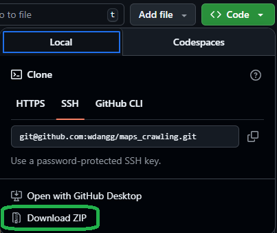

# 🗺️ Lấy dữ liệu tự động từ Google Maps

## 📥 Cách tải về
Nhấn **Code** và chọn **Download ZIP**  

## 📂 Cấu trúc thư mục và chức năng các file

### ⚙️ 1. `crawl.exe`
- Chạy file crawl để bot tự động cào dữ liệu theo từng **key search**.
- Cách dùng: sửa nội dung trong `input.txt` → chạy `crawl.exe`, rồi lại sửa key khác ytpng `input.txt` rồi lại chạy `crawl.exe` cho đến khi đủ số lượng key mong muốn.  

**📌 Lưu ý:**
- Nên chọn các key có phạm vi nhỏ để kết quả sát hơn.  
  Ví dụ: `"sân bóng ở hà nội"` thay vì `"sân bóng ở Việt Nam"`.  
- Chỉ nên chạy 1–2 key mỗi lần. Sau khi xong thì sửa lại file `input.txt` rồi chạy tiếp.  
- Nếu chạy quá nhiều key cùng lúc dễ gây treo máy hoặc tràn RAM. Cũng có thể Gg maps sẽ render lại dẫn đến lấy data thiếu hoặc bị gián đoạn, nên khoanh vùng cần tìm kiếm để chạy mượt mà và rủi ro mất data.

### 🧮 2. `merge.exe`
- Sau khi đã chạy đủ các key, chạy `merge.exe` để tổng hợp kết quả tìm kiếm từ nhiều lần crawl.  

---

## ▶️ Cách chạy

⚠️ **Lưu ý:** Trước khi chạy một nhóm key mới, hãy xóa các file `.xlsx` trong thư mục hiện tại và các file `.csv` trong thư mục `output/` để tránh kết quả cũ bị gộp lại.  

1. **📝 Bước 1:** Sửa key search trong `input.txt`, sau đó chạy `crawl.exe`.  
2. **📊 Bước 2:** Chạy `merge.exe`.  
   - Kết quả sẽ là một file tổng hợp dữ liệu, mặc định tên là **`merged_output.xlsx`**.  

---
